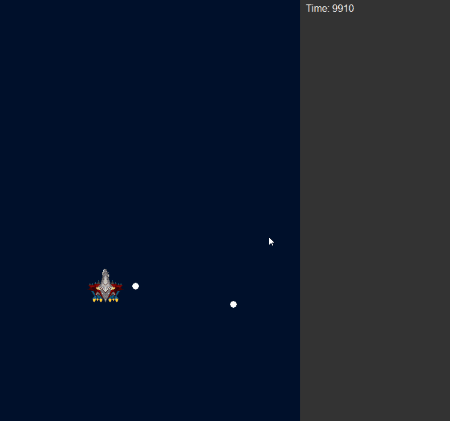
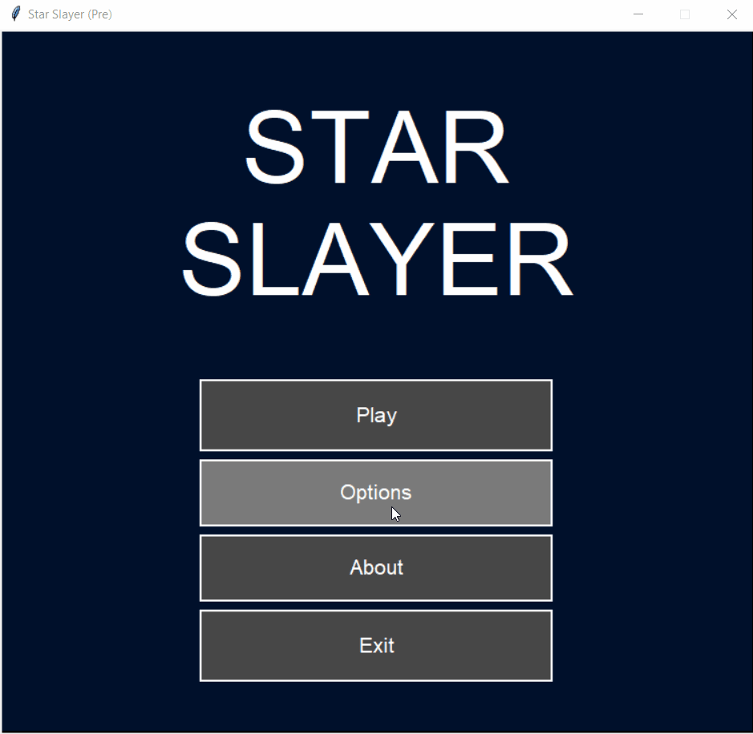

# STAR SLAYER

A project initially thought as a hobby for testing the single-file game library "Gamelib" (made by [Diego Essaya](https://github.com/dessaya)), which can be found [here.](https://github.com/dessaya/python-gamelib)

<hr style="height:30px"/>

* [ Proyect is currently **ON HIATUS** ]

<hr style="height:30px"/>

## Planned Features:


### Gameplay

As far as it was originally planned, *Star Slayer* is a "Shoot 'em all!" minigame in which you control a spaceship and destroy all enemies. Simple, right?


*(A mighty and playable gameplay may be far from enjoyable as of yet right now though)*
<br/>


### A ~_totally not boring_~ enjoyable menu!

Is very ~_tasteless_~ of minimalistic style, and you can interact with ease with its oversimplified options.



Brought to you by customizable classes made with amateur skills but somewhat manageable! Found on [objects.py](objects.py) file.

```Python
class Menu:

    def __init__(self, button_titles, area_corners, max_buttons=4, space_between=10, parent_menu=None, force_button_resize=False, is_sub=False):
        """
        ______________________________________________________________________

        button_titles: <list> --> [<str>, <str>, ... , <str>]

        area_corners: <tuple> --> (<int>, <int>, <int>, <int>)

        max_buttons, space_between: <int>

        parent_menu: <Menu>

        force_button_resize, is_sub = <bool>


        ---> None
        ______________________________________________________________________

        Initializes an instance of type 'Menu'.

        'button_titles' must be a non-empty tuple.

        'max_buttons' cannot be an integer lower than 1.

        'area_corners' must be a tuple of exactly 4 integers as its values.
        """

        if button_titles == ():

            raise Exception("'button_titles' cannot be empty. Must be an iteration with names (strings) and must have a length of at least 1")

        if max_buttons < 1:

            raise Exception("'max_buttons' must be an integer of 1 or higher")

        if not len(area_corners) == 4:

            raise Exception(f"'area_corners has {len(area_corners)}. It must have exactly 4 integers as values'")

        button_titles = (button_titles.split("-=trash_value=-") if isinstance(button_titles, str) else list(button_titles))

        buttons_len = len(button_titles)

        if force_button_resize and buttons_len < max_buttons:

            max_buttons = buttons_len

        self.area_x1, self.area_y1, self.area_x2, self.area_y2 = area_corners

        self.max_buttons = max_buttons
        self.button_space = (self.area_y2 - self.area_y1) // self.max_buttons
        self.max_pages = (((buttons_len // self.max_buttons) + 1) if all((buttons_len != self.max_buttons, buttons_len % self.max_buttons != 0)) else buttons_len // self.max_buttons)
        self.current_page = 1
        self.parent = parent_menu

        self.pgup_button = Button((self.area_x2 + space_between), self.area_y1, self.area_x2 + (self.button_space // 2), (self.area_y1 + (self.button_space // 2)), ('🠕' if is_sub else '↑'))
        self.pgdn_button = Button((self.area_x2 + space_between), (self.area_y2 - (self.button_space // 2)), self.area_x2 + (self.button_space // 2), self.area_y2, ('🠗' if is_sub else '↓'))
        self.return_button = Button(self.area_x1, self.area_y1 - (EXT_CONST["HEIGHT"] // 20), self.area_x1 + (EXT_CONST["WIDTH"] // 20), self.area_y1 - space_between, '←')

        self.buttons = self.generate_buttons(button_titles, space_between)
        self.buttons_on_screen = self.update_buttons()

        self.press_cooldown = Timer(20)

    def generate_buttons(self, titles_list, space_between=0):
        """
        ______________________________________________________________________

        titles_list: <list> -->  [<str>, <str>, ... , <str>]

        space_between: <int>


        ---> <list> --> [<Button>, <Button>, ... , <Button>]
        ______________________________________________________________________

        Generate buttons based on the effective area of the menu and the 'self.button_titles' list.
        'space_between' determines how much dead space there is between each button in said area.
        """
        buttons_list = list()
        counter = 0

        for title in titles_list:

            counter %= self.max_buttons
            x1, x2 = self.area_x1, self.area_x2
            y1 = (counter * self.button_space) + self.area_y1 + (0 if counter == 0 else space_between // 2)
            y2 = ((counter + 1) * self.button_space) + self.area_y1 - (0 if counter == (self.max_buttons - 1) else space_between // 2)

            buttons_list.append(Button(x1, y1, x2, y2, title))

            counter += 1

        return buttons_list

    def update_buttons(self, page=1):
        """
        ______________________________________________________________________

        page: <int>


        ---> <list> --> [<Button>, <Button>, ... , <Button>]
        ______________________________________________________________________

        Updates the buttons list if the menu changes pages.

        The page number must be between 1 and the max values for the pages.
        """
        if 1 > page or self.max_pages < page:

            raise Exception(f"Page number is {page}. It must be between 1 and {self.max_pages} inclusive.") 

        buttons_list = list()

        for i in range((page - 1) * self.max_buttons, page * self.max_buttons):

            if i < len(self.buttons):

                buttons_list.append(self.buttons[i])

        if self.current_page < self.max_pages:

            buttons_list.append(self.pgdn_button)
        
        if self.current_page > 1:

            buttons_list.append(self.pgup_button)

        if self.parent: # add return button only if it is the main menu or a sub menu

            buttons_list.append(self.return_button)

        return buttons_list

    def change_page(self, to_next=True, forced=False):
        """
        ______________________________________________________________________

        to_next, forced: <bool>


        ---> None
        ______________________________________________________________________

        Changes the current page to the previous or next one, depending of the parameter 'to_next'.
        If the new page is outside of the number of pages, does nothing if 'forced' is False, otherwise it rotates between the pages.
        """
        if forced:

            new_page = (self.max_pages % self.current_page) + 1

        else:

            new_page = (self.current_page + 1 if to_next else self.current_page - 1)
        
        if 1 <= new_page <= self.max_pages:

            self.current_page = new_page
            self.buttons_on_screen = self.update_buttons(new_page)
```
<br/>

**Example call:**
```Python
main_menu = Menu(('Play', 'Options', 'About', 'Exit'), (200, EXT_CONST['HEIGHT'] // 2, EXT_CONST['WIDTH'] - 200, EXT_CONST['HEIGHT'] - 50))
```
<br/>

## Don't miss out!
<br/>

If you just happened to be as bored as I was to think of this, feel free to kill time contributing to the cause! Anyone can contribute, but it may
require a review from me or similar, as the rules protecting the main branch changes even so and then...
